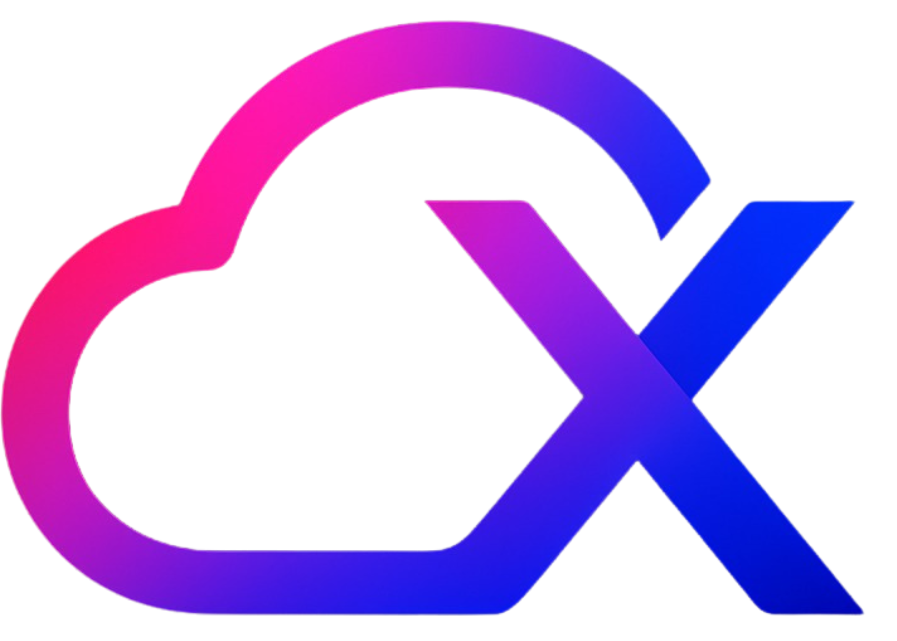

  
  <h1>CloudX-SRMIST</h1>

**Event Name :** AWS Ascend  
**Date :** 25th September

 

  <h3>Tech Used</h3>
  

    
    &nbsp;
    
    &nbsp;
    
  

 

  
All Rights Reserved. | <a href="LICENSE">License</a>

